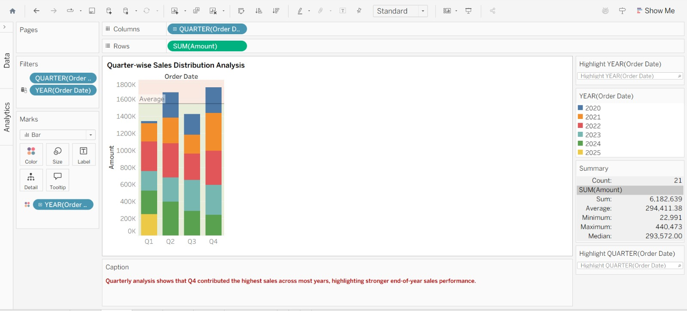

# 📊 Sales Analytics Dashboard using Tableau

## 🔹 Objective
The objective of this project is to analyze multi-year retail sales data and identify key sales trends, performance patterns, and business improvement opportunities using interactive Tableau dashboards.

---

## 🔹 Tools Used
- Tableau
- Microsoft Excel

---

## 🔹 Dataset
The dataset contains retail sales transaction data, including:
- Order Date
- Product Categories
- Sales Amount
- Quarterly Performance
- Year-wise Revenue Trends

---

## 🔹 Data Analysis Performed
- Conducted year-wise sales trend analysis to identify growth and decline patterns
- Analyzed category-wise sales contribution to evaluate product performance
- Examined quarterly sales distribution to identify seasonal demand trends
- Compared sales performance across multiple years and quarters
- Created interactive visualizations for better business insight generation

---

## 🔹 KPI Highlights
- **Total Sales:** 6.2M
- **Average Sales:** 1.03M
- **Best Performing Year:** 2022
- **Highest Performing Quarter:** Q4

---

# 📊 Sales Analytics using Tableau

---

## 🔹 Key Insights
- Sales showed a steady increase from 2020 and reached peak performance in 2022
- A decline in sales was observed in later years, especially in 2025
- Product categories contributed almost evenly to overall sales, indicating a balanced product portfolio
- Q4 consistently generated higher sales compared to other quarters, highlighting seasonal business trends
- Sales intensity analysis showed 2022 as the strongest performing year

---

## 🔹 Business Recommendations
- Reapply successful strategies used during the peak sales period in 2022
- Investigate factors contributing to declining sales in later years
- Utilize high-performing quarters for targeted marketing and promotional campaigns
- Focus on improving underperforming periods to maintain consistent yearly growth
- Continue maintaining balanced category performance while optimizing top-selling products

---

## 🔹 Dashboard Features
- Year-wise Sales Trend Analysis
- Quarterly Sales Distribution Analysis
- Category-wise Contribution Analysis
- Sales Intensity Heatmap Visualization
- Interactive Business Insight Reporting

---

## 🔹 Dashboard Preview
(Add dashboard screenshot here)

---

## 🔹 Skills Demonstrated
- Data Visualization
- Dashboard Design
- Business Intelligence
- Trend Analysis
- Analytical Storytelling
- Tableau Dashboarding
- Business Insight Generation

---

## 🔹 Conclusion
This project demonstrates how data visualization and dashboard analytics can be used to uncover trends, analyze business performance, and support data-driven decision-making. The dashboard provides meaningful insights into sales behavior, seasonal performance, and category contribution, helping businesses make informed strategic decisions.
